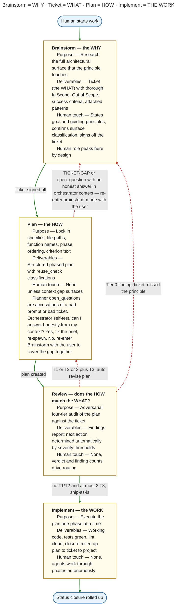

# Knowledge

*An engineering operating system for LLMs.*

LLMs have great short-term memory and zero long-term memory. Knowledge
fixes this. It runs as a local MCP server: collectors pull your code,
cloud infrastructure, logs, and docs into a queryable graph; your LLM
searches that graph instead of grepping, externalizes its reasoning as
hypotheses charged with evidence, and runs tickets and plans against
state that survives every context boundary — across sessions, machines,
and teammates.

## What it solves

Knowledge exists because the same problems keep recurring in serious
LLM-driven development:

- **Finding code, and reusing it accurately.** Hybrid BM25 + semantic
  search over an indexed call graph, plus tree-sitter AST search for
  structural shapes — "is there code that *does* this" gets a real
  answer instead of a grep guess, so agents extend what exists instead
  of re-implementing it.
- **A development flow that scales past one agent.** The orchestrator
  pattern for subagents: one coordinator dispatching researchers,
  planners, reviewers, and implementers against shared graph state,
  instead of a single context trying to hold everything.
- **Plan tracking that survives execution.** Projects, tickets, and
  plans live in the graph — searchable, statused, and linked to the
  code they touch — so implementation follows a tracked plan with
  verifiable success criteria rather than a vibe.
- **Longer, uncapped sessions.** Active work is retraceable through the
  graph, so a compaction or restart is a non-event. Multi-week sessions
  are not a problem.
- **Better standards, less naive code.** Practice graphs collected from
  books, references, and websites put best-practice patterns next to
  your code, so agents reach for the established idiom instead of the
  first thing that compiles.
- **Auditable reasoning.** Thoughts and decisions are graph nodes with
  evidence attached — searchable long after the fact, so "why did we
  do it this way" has an answer months later.
- **Cold starts that aren't cold.** New sessions recall past thoughts
  and decisions before starting work, so every session begins where the
  last one actually left off.
- **Full-stack tracing.** Cloud, CI/CD, and log collectors link
  infrastructure and runtime state to code in one graph — an incident
  traces from log line to deploy to commit to the design decision
  behind it.

## Install

One line, macOS (Apple Silicon) or Linux (x86_64 / arm64):

```bash
curl -fsSL https://raw.githubusercontent.com/fulminate-io/knowledge-mcp/main/install.sh | sh
```

The script downloads the latest release of both binaries
(checksum-verified) into `~/.knowledge/bin`, then hands off to
`knowledge setup`, which writes your first-run config (auto-detecting
an LLM provider), installs the curated agents and skills for Claude
Code and/or Codex if those CLIs are present, registers the MCP daemon
with them, and installs user-level services (launchd on macOS,
`systemd --user` on Linux) so the graph server (127.0.0.1:15022) and
MCP daemon (127.0.0.1:15023) start at login. Everything runs as
**your user** — no `sudo` anywhere.

Re-running the same line upgrades in place; your config is never
touched. To configure interactively (pick a provider, paste optional
API keys), run `knowledge setup` in a terminal any time. Headless
provisioning: append flags after `sh -s --` (e.g. `--headless`,
`--no-service`); credentials come from the environment
(`ANTHROPIC_API_KEY`, `VOYAGE_API_KEY`, `LINEAR_API_KEY`, ...) or
`~/.knowledge/config` — never from flags. On Windows, follow the
[manual install guide](./docs/guides/install-windows.md).

### Homebrew (alternative)

```bash
brew tap fulminate-io/knowledge
brew install knowledge
brew services start knowledge-server   # local graph server  (127.0.0.1:15022)
brew services start knowledge          # shared MCP daemon    (127.0.0.1:15023)
knowledge install-claude-assets        # wire Claude Code (or: install-codex-assets)
```

Run the services as **your user** — do not `sudo`; a root LaunchDaemon
can't read your login keychain.

### First index

Restart your editor so it picks up the new MCP server, then trigger the
first index from inside the LLM:

```jsonc
collect({ "type": "code", "id": "/absolute/path/to/repo" })
```

The first pass takes 30s–2min for a typical repo: tree-sitter chunks
the files, the LLM summarizes each node. Subsequent indexes are
incremental — only changed files re-summarize.

No credentials are required to get here. On first run the server
auto-detects an LLM provider: it prefers a logged-in Claude or Codex
CLI on `$PATH`, then falls back to `ANTHROPIC_API_KEY`,
`OPENAI_API_KEY`, or `GEMINI_API_KEY` from the environment.

> [!WARNING]
> **First-time indexing of a large repo can quickly use up a Claude or
> Codex subscription's session quota.** The initial pass summarizes
> every node — for a big repo that is thousands of LLM calls — and when
> the auto-detected provider is your logged-in `claude` or `codex` CLI,
> every one of them draws on your subscription. Take caution on a large
> first index, or point the summarizer at an API provider for it: add a
> `[summarizer]` section to `~/.knowledge/config` with `provider =
> "anthropic"`, `"openai"`, or `"gemini"` and the matching API key,
> restart the daemon, then collect. See
> [Configuration](./docs/guides/config.md). Subsequent indexes are
> incremental and cheap either way.

Full walkthroughs: **[Set up with Claude Code](./docs/guides/setup-claude.md)**
· **[Set up with Codex](./docs/guides/setup-codex.md)**. `knowledge doctor`
diagnoses install and daemon/server health. Connecting another MCP
client by hand? Point it at the daemon's streamable-HTTP endpoint:
`http://127.0.0.1:15023/mcp`.

### From source

Requirements: Go 1.26+, CGO enabled (tree-sitter C bindings). Building
from source produces the `knowledge` binary only; run `knowledge
install` afterwards to fetch the matching prebuilt `knowledge-server`
from GitHub releases (checksum-verified).

```bash
git clone https://github.com/fulminate-io/knowledge-mcp.git
cd knowledge-mcp
CGO_ENABLED=1 go build -o bin/knowledge .
```

Source-built users (no `brew services`) run the processes by hand:

```bash
knowledge serve                    # MCP daemon on 127.0.0.1:15023
knowledge start / status / stop    # knowledge-server lifecycle (15022)
```

## Two keys worth setting

Both are optional; both change what you get.

| Key | With it | Without it |
| --- | --- | --- |
| `VOYAGE_API_KEY` | Hybrid semantic + keyword search — the LLM finds code and knowledge by meaning | Keyword (BM25) search only |
| `LINEAR_API_KEY` | Projects and tickets sync to Linear in real time; status flows both ways | Tickets stay local to the graph |

Get a Voyage key at [voyageai.com](https://voyageai.com); the Linear
key is a personal API key from Linear's settings (Settings → API).
Both go in `~/.knowledge/config` (TOML, auto-created on first run;
config wins over the environment):

```toml
[credentials]
voyage_api_key = "..."
linear_api_key = "..."
```

To pin LLM providers and models explicitly, the same file takes
`[default]` and per-consumer sections — see
[Configuration](./docs/guides/config.md) for the full reference.

## How it works



The four kernel layers are simple: collectors are the drivers, search
and traverse are the syscalls, thoughts and decisions and plans are the
persistent state, and brainstorm → ticket → plan → revise → implement
is the process model.

## What you get

**Reasoning that survives sessions.** Hypotheses are first-class graph
nodes; evidence attaches as weighted positive or negative charges, and
propagation lets contradictory beliefs find equilibrium. The LLM
externalizes its working beliefs in one session and recalls the
contested threads in the next, full charge history intact. This is the
differentiator — everything else feeds it. See
[Reasoning](./docs/guides/reasoning.md).

**Search across everything you have.** Hybrid BM25 + vector search over
one query surface: code (30+ languages, tree-sitter chunked), decisions,
findings, cloud resources, log streams, and docs — plus structural AST
search for the shapes regex can't express. Results are graph nodes: walk
from a search hit to its callers, to the decision that introduced it, to
the cloud resource that runs it.

**Real workflow integration.** Brainstorm → ticket → plan → revise →
implement, with every artifact in the graph and tickets synced to
Linear in real time. Failures land as findings linked to the step, not
as lost work — the next session picks up where the last one stopped.
Jira, GitHub Issues, and Asana are on the roadmap.

**Persistent context the LLM trusts.** Collectors for code, cloud
(AWS, GCP, Azure, Kubernetes), logs (CloudWatch, Loki, Elasticsearch,
Stackdriver, K8s Events), web pages, and PDFs — each a graph, all
cross-linked. Walk from a failing log line to the code that emitted it,
the resource it ran on, and the decision behind that code, in one call.

The full narrative for each pillar lives in the
[guides](./docs/guides/index.md).

## Documentation

Step-by-step guides ship in [`docs/guides/`](./docs/guides/index.md):
setup ([Claude Code](./docs/guides/setup-claude.md),
[Codex](./docs/guides/setup-codex.md),
[Configuration](./docs/guides/config.md)), the mental model
([Concepts](./docs/guides/concepts.md),
[Reasoning](./docs/guides/reasoning.md)), collection
([Web](./docs/guides/web-collection.md) ·
[PDF](./docs/guides/pdf-collection.md) ·
[Recipes](./docs/guides/recipes.md)), and reference
([Binaries & CLI](./docs/guides/binaries.md) ·
[Agents](./docs/guides/agents.md) · [Skills](./docs/guides/skills.md)).

## Tools

22 MCP tools across the ten graph families. The full reference is
[KNOWLEDGE_TOOLS.md](./KNOWLEDGE_TOOLS.md). The ones you'll touch
daily: `search`, `ast`, `traverse`, `thoughts`, `record_decision`,
`create_project` / `create_ticket` / `create_plan`, `assemble`,
`collect`. Generic primitives — `query`, `mutate`, `delete`,
`manage` — route by graph and operation.

## Fulminate Cloud (optional)

Knowledge OSS runs entirely local — bring your own LLM, zero
credentials, full feature set. For teams that want a hosted shared
graph, always-on investigation agents, webhook reception, scheduled
workflows, and enterprise governance (SSO/SCIM, RBAC, audit, BYOC),
[Fulminate Cloud](https://fulminate.io) offers capabilities that
structurally can't run on a laptop. All tiers are BYOK — bring your
LLM key, Fulminate never resells tokens.

```bash
knowledge login    # browser-PKCE OAuth flow; token stored in your keychain
knowledge logout   # revoke + clear keychain
```

Logged in, the daemon serves tool calls from the hosted graph server;
logged out, it runs fully local. A subscription with
`mcp:knowledge:write` permission unlocks the `sync` tool: push local
graph state to cloud, pull team-visible state down, promote a working
copy as the team head.

## Status

Pre-1.0. Active development toward Apache 2.0 OSS launch.

**Shipping today**: MCP server with ten-graph architecture, thought
reasoning with DeGroot propagation, 30+ topology analyzers, branch
overlays, auto-compaction recovery, tokenless OSS boot, browser-PKCE
OAuth login with keychain-backed credentials.

## Contributing

Contribution guide, build rules, test conventions, and architectural
constraints: [CLAUDE.md](./CLAUDE.md).

## License

Apache 2.0 on OSS launch. See [LICENSE](./LICENSE).
Fulminate Cloud commercial use is separately licensed; see
[fulminate.io/legal](https://fulminate.io/legal).
